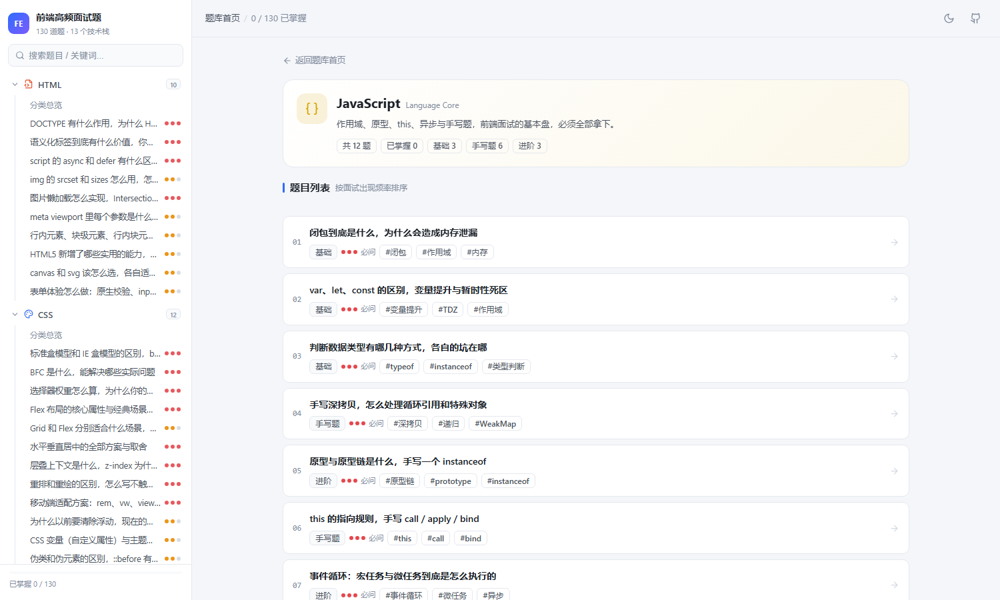
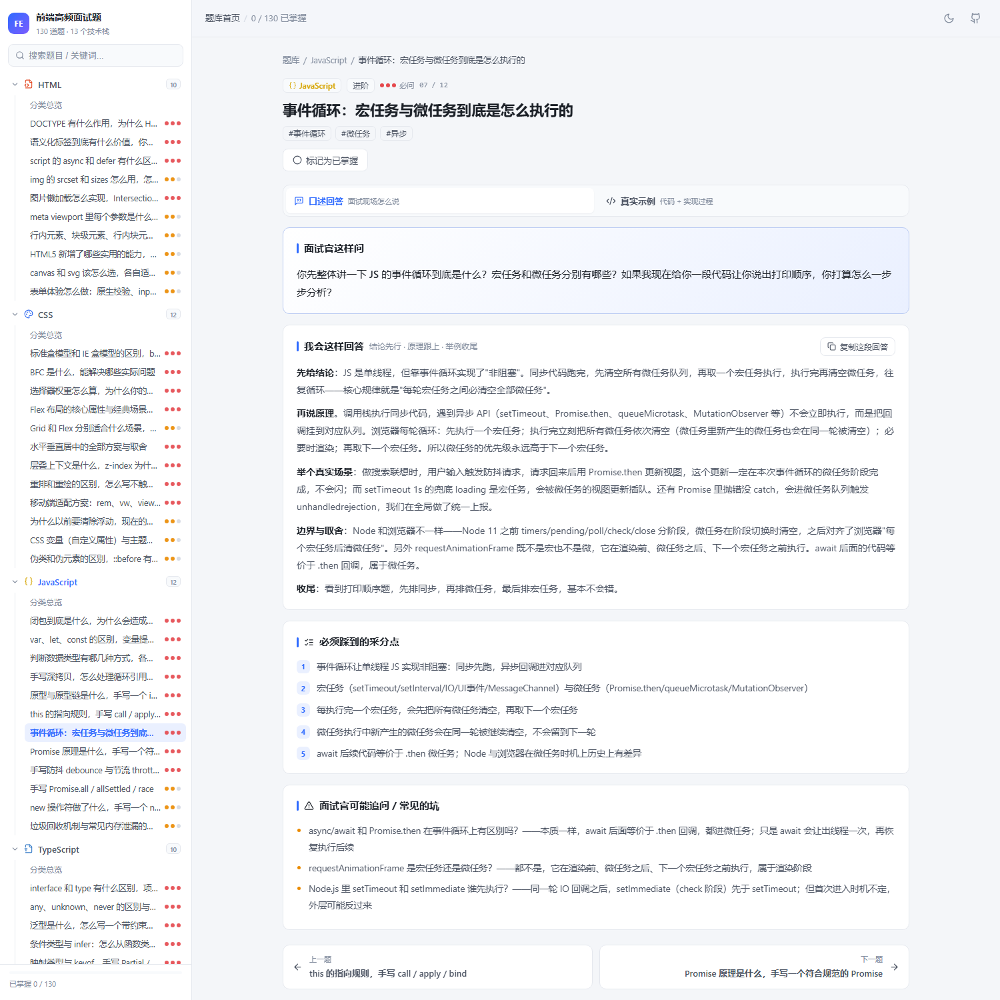
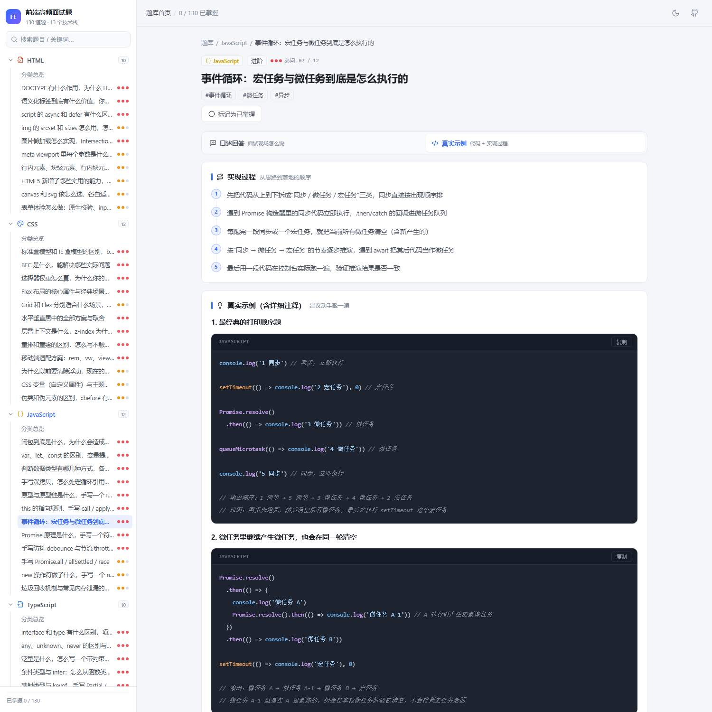
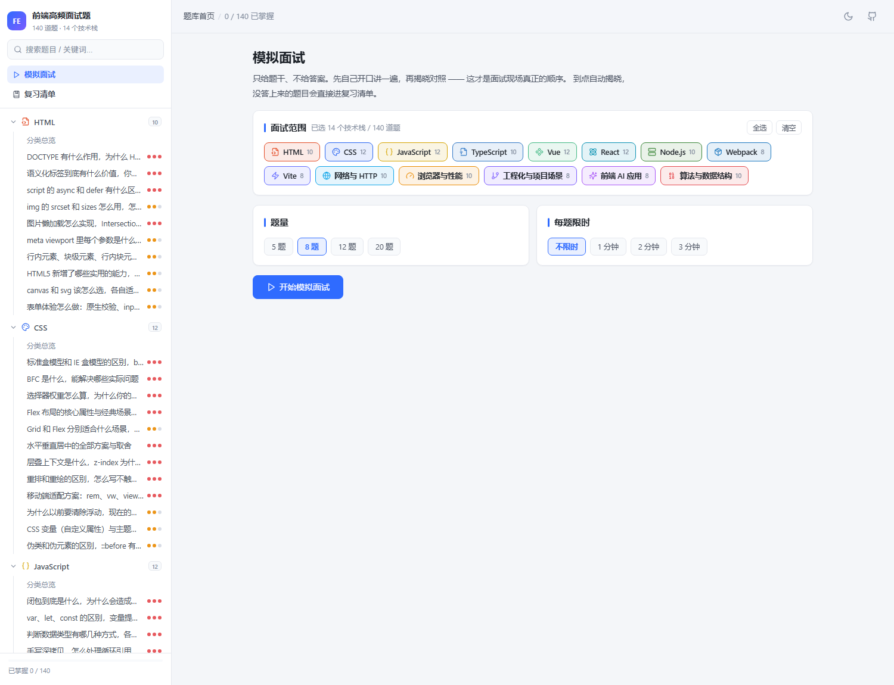
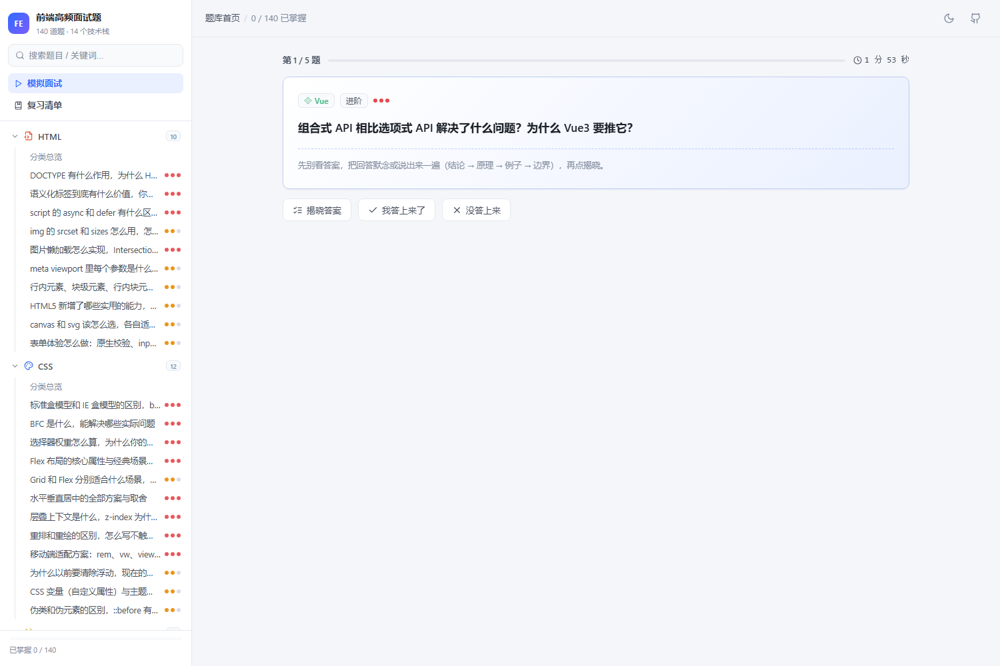
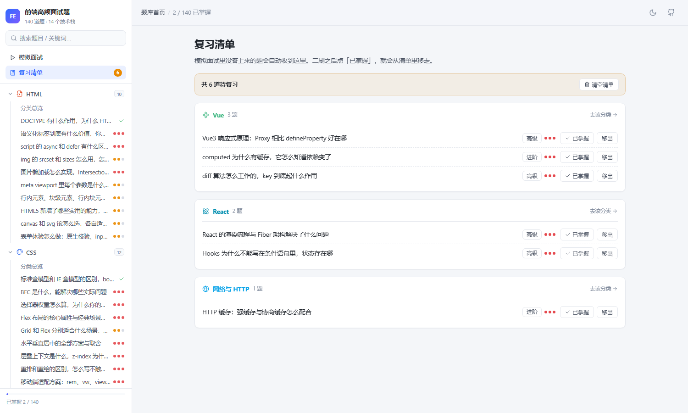

# 前端高频面试题 · 实战手册

一个 Vue 3 + TypeScript 的面试题库应用。**140 道高频题**，按 14 个技术栈分组，每题都配齐三样东西：

| 板块 | 内容 | 面向 |
| --- | --- | --- |
| **口述回答** | 能直接在面试现场说出口的话，结论 → 原理 → 真实场景 → 边界取舍 | 面试官 |
| **真实示例** | 2~4 段可运行代码，逐行中文注释，带输出结果或正反例对比 | 自己 |
| **实现过程** | 从思路到落地的分步骤拆解 | 自己 |

外加「必须踩到的采分点」和「面试官可能追问 / 常见的坑」。

**在线访问：** <https://9d5f94d8228b4cb7bc0d9e6ff82dff6e.app.workbuddy.host>

纯静态站点（无后端），刷题进度和复习清单都存在浏览器 `localStorage`，不上传服务器。


---

## 快速开始

```bash
npm install
npm run dev          # http://localhost:5188
```

其他命令：

```bash
npm run build        # 内容自检 → 类型检查 → 打包
npm run preview      # 预览打包产物
npm run check:content # 只跑内容自检脚本
npm run typecheck    # 只跑 vue-tsc
```

---

## 技术栈与题目分布

| # | 分类 | 题数 | 代表考点 |
| --- | --- | --- | --- |
| 1 | HTML | 10 | DOCTYPE、语义化、async/defer、懒加载 |
| 2 | CSS | 12 | 盒模型、BFC、权重、Flex/Grid、层叠上下文 |
| 3 | JavaScript | 12 | 闭包、原型链、this、事件循环、手写题 |
| 4 | TypeScript | 10 | 泛型、条件类型、映射类型、类型守卫 |
| 5 | Vue | 12 | 响应式原理、diff、nextTick、编译优化 |
| 6 | React | 12 | Fiber、Hooks 原理、并发特性、性能优化 |
| 7 | Node.js | 10 | 事件循环、Stream、中间件、断点续传 |
| 8 | Webpack | 8 | 构建流程、loader/plugin、HMR、体积优化 |
| 9 | Vite | 8 | No-bundle、依赖预构建、HMR、插件机制 |
| 10 | 网络与 HTTP | 10 | 缓存、HTTPS、TCP、CORS、HTTP/2/3 |
| 11 | 浏览器与性能 | 10 | 渲染流程、Web Vitals、首屏优化、rAF |
| 12 | 工程化与项目场景 | 8 | Git、监控、CI/CD、微前端、组件库 |
| 13 | 前端 AI 应用 | 8 | SSE 流式、打字机、RAG、Function Calling |
| 14 | 算法与数据结构 | 10 | 复杂度、链表、栈队列、LRU、排序、DP、前端手写 |
| | **合计** | **140** | |

---

## 内容架构（这个项目最值得说的一点）

**结构用 TS，内容用 Markdown，两者完全解耦。**

每个技术栈对应 `src/content/` 下的一个 `.md` 文件，题目就写在里面：

```md
---
id: javascript
name: JavaScript
en: Language Core
icon: braces
color: #d6a400
order: 3
---

## 01 · 闭包到底是什么，为什么会造成内存泄漏

@id
js-closure

@level
基础

@freq
3

@tags
闭包 | 作用域 | 内存

@ask
你说说闭包是什么？…

@oral
**先说结论**：闭包就是「函数 + 它定义时所在的那个词法环境」…

@points
- 闭包 = 函数 + 定义时的词法环境
- 变量从调用栈转移到堆上的闭包对象

@steps
1. 先复述定义
2. 解释变量为什么能活下来

@followups
闭包里的变量存在哪？——存在堆上的 Context 对象里

@example
（这里就是普通 markdown，代码块、表格、引用随便写，不用转义）
```

`src/utils/contentParser.ts` 负责把这些 `@` 指令解析成类型安全的 `Category[]`，
`src/data/index.ts` 用 `import.meta.glob` 在编译期把所有 markdown 收进来。

**为什么不直接写在 `.ts` 里？** 因为每道题都有大量代码块。写成 TS 模板字符串的话，
反引号和 `${}` 全都要转义，几百个代码块下来必然出错，源码也没法读。分开之后：

- 加一个新题 → 改 markdown，不动代码
- 加一个新技术栈 → 新建一个 `.md`，刷新页面就出现
- 单个技术栈内容太多 → 拆成多个文件，只要 frontmatter 的 `id` 相同、`part` 递增，就会自动合并到同一个菜单分组下（JavaScript 就是这么拆成 `javascript-basics.md` + `javascript-async.md` 的）

### 内容自检

`npm run check:content` 会在构建前扫描所有 markdown，拦住这几类会让解析错位的问题：

- 代码块围栏没闭合（会导致后面的内容全被吞进代码块）
- 代码块**内部**出现 `## ` 开头的行（会被误判成一道新题，所以示例里只能用 `###` 及以下标题）
- 缺少 `@ask` / `@oral` / `@example` 等必需指令
- 题目 `id` 重复（会导致路由互相覆盖）、`@level` / `@freq` 取值非法

---

## 项目结构

```
fe-interview-hub/
├─ scripts/
│  └─ validate-content.mjs      # 内容自检脚本
├─ src/
│  ├─ content/                  # 所有题目内容（改内容只动这里）
│  │  ├─ _template.md           # 写作样板，下划线开头不参与渲染
│  │  ├─ html.md  css.md  javascript-basics.md  algorithm.md  …
│  ├─ data/index.ts             # 汇总、排序、合并、搜索
│  ├─ utils/
│  │  ├─ contentParser.ts       # markdown → Category 解析器
│  │  ├─ markdown.ts            # markdown-it + 代码高亮 + 复制按钮
│  │  └─ codeCopy.ts            # 代码块复制的全局事件委托
│  ├─ composables/
│  │  ├─ useLocalSet.ts         # localStorage 集合的通用实现（单例）
│  │  ├─ useProgress.ts         # 刷题进度（localStorage）
│  │  ├─ useReview.ts           # 复习清单（localStorage）
│  │  └─ useTheme.ts            # 浅色 / 深色主题
│  ├─ components/
│  │  ├─ AppSidebar.vue         # 左侧技术栈菜单
│  │  ├─ CategoryIcon.vue       # 分类图标映射
│  │  └─ FreqDots.vue           # 面试频率指示器
│  ├─ views/
│  │  ├─ HomeView.vue           # 首页总览 + 随机抽题
│  │  ├─ CategoryView.vue       # 分类题目列表
│  │  ├─ QuestionView.vue       # 题目详情（口述回答 / 真实示例）
│  │  ├─ SearchView.vue         # 关键词搜索
│  │  ├─ MockView.vue           # 模拟面试：随机出题 + 倒计时 + 自评
│  │  └─ ReviewView.vue         # 复习清单：按分类分组的待复习题
│  ├─ router/index.ts
│  └─ styles/                   # CSS 变量 + 基础样式 + markdown 排版
└─ vite.config.ts
```

## 路由

| 路径 | 说明 |
| --- | --- |
| `/` | 首页：统计、分类入口、随机抽一题 |
| `/c/:categoryId` | 某技术栈的题目列表，按面试频率排序 |
| `/q/:questionId` | 题目详情，`?tab=code` 可直接定位到代码示例页签 |
| `/search?q=xxx` | 搜索结果 |
| `/mock` | 模拟面试，支持 `?cats=vue,react&count=5&limit=120` 直接配置一场面试 |
| `/review` | 复习清单 |

> 用 hash 模式（`#/q/xxx`），所以 `dist/` 可以直接双击打开，也能扔到任意静态托管上，
> 不需要服务端 rewrite 规则。

## 功能

- **左侧菜单按技术栈分组**，可折叠，自动展开当前题目所在分组，支持关键词实时过滤
- **刷题进度**：点「标记为已掌握」，进度存 localStorage，侧边栏打勾并显示总进度条
- **模拟面试**：从指定技术栈随机抽题、倒计时、逐题自评；没答上来的自动进复习清单
- **复习清单**：按技术栈分组展示待复习题，侧边栏显示角标数量
- **代码块**：语法高亮 + 语言标签 + 一键复制（40+ 种语言，按需加载不打包全量）
- **深浅色主题**：CSS 变量实现，切换记忆到 localStorage
- **移动端适配**：窄屏下侧边栏变抽屉
- **搜索**：标题 > 标签 > 分类 > 题干 > 正文的权重排序

## 界面预览

| 分类列表 | 题目详情 · 口述回答 |
| --- | --- |
|  |  |

| 题目详情 · 真实示例 | 模拟面试 |
| --- | --- |
|  |  |

| 答题中（倒计时） | 复习清单 |
| --- | --- |
|  |  |

## 新增一道题

1. 打开对应技术栈的 `.md` 文件（比如 `src/content/css.md`）；
2. 参考 `src/content/_template.md`，在文件末尾追加一段：

```md
## 13 · 你的新题目

@id
css-your-new-id

@level
进阶

@freq
2

@tags
标签1 | 标签2

@ask
面试官会怎么问？

@oral
你的口语化回答。

@points
- 采分点

@steps
1. 第一步

@followups
追问？——答案

@example
### 示例标题

```css
/* 带注释的代码 */
```
```

3. 保存，`npm run dev` 会自动刷新。构建前跑一次 `npm run check:content` 确认格式没问题。

## 部署

纯静态站点，`npm run build` 产出的 `dist/` 就是全部需要的东西：

```bash
npm run build
# 方式一：扔到任意静态托管（Vercel / Netlify / GitHub Pages / OSS），发布 dist 目录
# 方式二：自己的服务器
scp -r dist/* user@host:/var/www/tiku/    # Nginx 指向该目录即可
```

因为用的是 hash 路由，**不需要配置任何 rewrite / 404 回退规则**，这是选 hash 模式最实际的理由。
